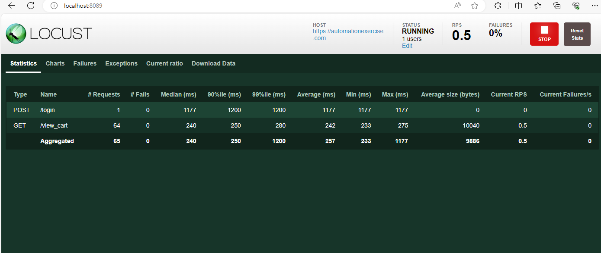

# Locust Python

[](https://www.python.org/downloads/release/python-3110/)
[](https://pypi.org/project/locust/)

## Installation
#### Python => 3.11
#### Locust => 2.21

## Scripts

#### Write user test scenarios in plain Python

```python
from locust import events

from TaskSetLib.ViewCart import ViewCart
from UserLib.RegisteredHttpUser import RegisteredHttpUser
from CommonLib.UserLoader import UserLoader
from CommonLib.LogModule import Logger

@events.test_start.add_listener
def on_test_start(**kwargs):
    UserLoader.load_users()
    Logger.log_message("......... Initiating Load Test .......")


@events.test_stop.add_listener
def on_test_stop(**kwargs):
    Logger.log_message("........ Load Test Completed ........")

class UserGroupA(RegisteredHttpUser):
    weight = 1
    RegisteredHttpUser.tasks = [ViewCart]

```

## Run tests
```
    locust -f locustfile.py --host https://automationexercise.com
```

## Run tests with Docker
```
    docker run --rm -p 8089:8089 -v /${PWD}:/locust --name locust locust --host https://automationexercise.com
```

